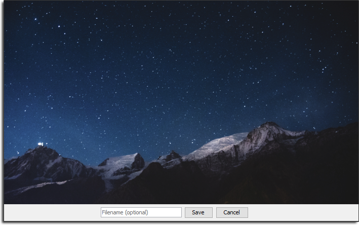

Img Snippet
===========

[](https://forthebadge.com)
[](https://forthebadge.com)

  


ImgSnippet allows users to capture *snippets* or take standard screenshots  
Captured screenshots are saved locally and uploaded to [imgur](http://www.imgur.com)  
Users are able to change the bindings, capture location and interface settings


## Getting started

### Prerequisites
- JRE 1.7+ (Running from a release only)
- JDK 1.7+ & Maven 3.3+ (Building project)

### Installation

- [Download](https://github.com/kyleruss/img-snippet/releases/latest) the latest stable release  
- Unzip the release contents into a suitable directory  
- Run `ImgSnippet.exe` to launch ImgSnippet  
- **Note:** Create a shortcut ImgSnippet and copy the shortcut into the `shell:startup` directory  
to launch ImgSnippet on Windows startup

### Build

- Clone the ImgSnippet repository

```
git clone https://github.com/kyleruss/img-snippet.git
```

- Build the project with maven

```
mvn package
```

**Note:** This project was developed in Netbeans and can be directly imported into the IDE

### Shortcuts

- Capture Snippet  
`Ctrl + Shift + 1`

- Take Screenshot  
`Ctrl + Shift + 2`

**Note:** Shortcuts can be changed in settings

## License

ImgSnippet is available under the MIT License  
See [LICENSE](LICENSE.txt) for more details
